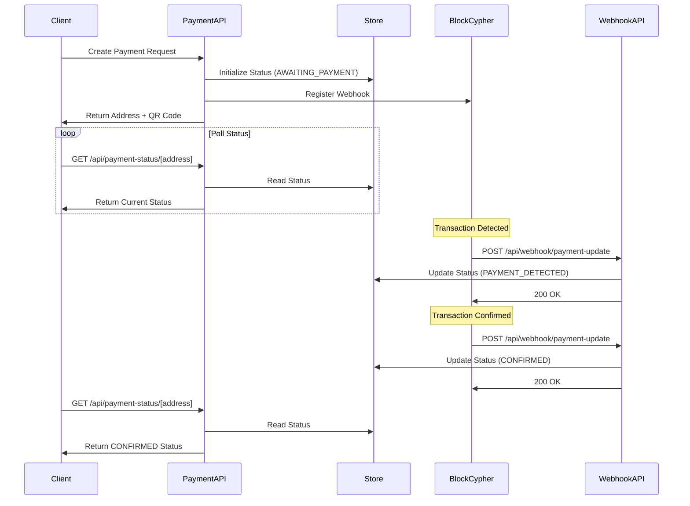

# API Routes Documentation

This directory contains all API endpoints for the Bitcoin Payment Application. The APIs handle payment status queries and webhook notifications from BlockCypher for real-time payment monitoring.

## Table of Contents

- [Overview](#overview)
- [Endpoints](#endpoints)
  - [Payment Status API](#payment-status-api)
  - [Webhook Payment Update API](#webhook-payment-update-api)
- [Authentication & Security](#authentication--security)
- [Error Handling](#error-handling)
- [Rate Limiting](#rate-limiting)
- [Data Flow](#data-flow)
- [Development Guide](#development-guide)
- [Testing](#testing)

## Overview

The API layer provides two primary functions:

1. **Payment Status Queries**: Allow clients to check payment status for specific Bitcoin addresses
2. **Webhook Processing**: Receive and process blockchain event notifications from BlockCypher

All APIs follow RESTful conventions and return JSON responses with appropriate HTTP status codes.

## Endpoints

### Payment Status API

**Endpoint**: `/api/payment-status/[address]`
**Method**: `GET`
**Purpose**: Retrieve the current payment status for a Bitcoin testnet address

#### Request

```http
GET /api/payment-status/tb1q7vuqq5tn8xpxfk9sfz8vu9jyypcf60n6qlj6mf HTTP/1.1
Host: your-domain.com
```

**Path Parameters**:

- `address` (required) - Bitcoin testnet address to check
  - Must be a valid testnet address format
  - Supported prefixes: `tb1` (native SegWit), `2` (P2SH), `m` or `n` (legacy)
  - Validated using regex: `/^(tb1[a-z0-9]{39,59}|[2mn][a-zA-Z0-9]{33,34})$/`

#### Response

**Success Response (200 OK)**:

```json
{
  "status": "PAYMENT_DETECTED",
  "confirmations": 3,
  "transactionId": "7c3b5e3a0f8d9e2c1b4a5f6e8d9c2b1a4f5e6d8c9b2a1f4e5d6c8b9a2f1e4d",
  "errorMessage": null,
  "lastUpdated": 1735678900000
}
```

**Response Fields**:

- `status` (string) - Payment status enum value:
  - `AWAITING_PAYMENT` - Payment request created, waiting for transaction
  - `PAYMENT_DETECTED` - Transaction detected but unconfirmed (0 confirmations)
  - `CONFIRMED` - Transaction has 1+ confirmations
  - `ERROR` - Error occurred (e.g., double-spend attempt)
- `confirmations` (number, optional) - Number of blockchain confirmations
- `transactionId` (string, optional) - Bitcoin transaction hash
- `errorMessage` (string, optional) - Error description if status is ERROR
- `lastUpdated` (number) - Unix timestamp in milliseconds

**Error Responses**:

_400 Bad Request_ - Invalid or missing address parameter

```json
{
  "error": "Missing address parameter"
}
```

_404 Not Found_ - No payment status found for address

```json
{
  "error": "Payment status not found"
}
```

_500 Internal Server Error_ - Unexpected server error

```json
{
  "error": "Failed to retrieve payment status"
}
```

#### Headers

**Response Headers**:

```http
Content-Type: application/json
Cache-Control: public, max-age=2
```

The 2-second cache helps reduce server load while maintaining near real-time updates.

#### Example Usage

**JavaScript/TypeScript**:

```typescript
async function checkPaymentStatus(address: string) {
  const response = await fetch(`/api/payment-status/${address}`);

  if (!response.ok) {
    throw new Error(`HTTP error! status: ${response.status}`);
  }

  const data = await response.json();

  switch (data.status) {
    case "AWAITING_PAYMENT":
      console.log("Waiting for payment...");
      break;
    case "PAYMENT_DETECTED":
      console.log(`Payment detected! ${data.confirmations} confirmations`);
      break;
    case "CONFIRMED":
      console.log(`Payment confirmed! TX: ${data.transactionId}`);
      break;
    case "ERROR":
      console.error(`Payment error: ${data.errorMessage}`);
      break;
  }
}
```

**cURL**:

```bash
curl -X GET "https://your-domain.com/api/payment-status/tb1q7vuqq5tn8xpxfk9sfz8vu9jyypcf60n6qlj6mf" \
  -H "Accept: application/json"
```

---

### Webhook Payment Update API

**Endpoint**: `/api/webhook/payment-update`
**Methods**: `POST`, `GET`
**Purpose**: Receive BlockCypher webhook notifications and update payment status

#### POST - Process Webhook

Receives and processes BlockCypher webhook notifications for Bitcoin transactions.

##### Request

**Headers** (Required):

```http
POST /api/webhook/payment-update HTTP/1.1
Host: your-domain.com
Content-Type: application/json
X-EventType: unconfirmed-tx
X-EventId: abc123-webhook-id
```

**Required Headers**:

- `X-EventType` - BlockCypher event type:
  - `unconfirmed-tx` - New unconfirmed transaction
  - `confirmed-tx` - Transaction confirmed
  - `tx-confirmation` - Transaction confirmation update
  - `double-spend-tx` - Double-spend attempt detected
  - `new-block` - New block mined (informational)

**Request Body**:

```json
{
  "hash": "7c3b5e3a0f8d9e2c1b4a5f6e8d9c2b1a4f5e6d8c9b2a1f4e5d6c8b9a2f1e4d",
  "addresses": [
    "tb1q7vuqq5tn8xpxfk9sfz8vu9jyypcf60n6qlj6mf",
    "tb1qyx8a0f9h6c5xpfk9sfz8vu9jyypcf60n6qlj7ng"
  ],
  "total": 100000,
  "fees": 1000,
  "confirmations": 0,
  "double_spend": false,
  "block_height": -1,
  "block_index": -1,
  "size": 250,
  "preference": "high",
  "received": "2024-01-01T12:00:00Z",
  "ver": 1,
  "vin_sz": 1,
  "vout_sz": 2,
  "inputs": [
    {
      "prev_hash": "6f5e4d3c2b1a0987654321fedcba9876543210fedcba9876543210fedcba98",
      "output_index": 1,
      "script": "...",
      "output_value": 150000,
      "sequence": 4294967295,
      "addresses": ["tb1qsender..."]
    }
  ],
  "outputs": [
    {
      "value": 50000,
      "script": "0014f2e00095273984926585849c6e164241129d3e7",
      "addresses": ["tb1q7vuqq5tn8xpxfk9sfz8vu9jyypcf60n6qlj6mf"],
      "script_type": "pay-to-witness-pubkey-hash"
    },
    {
      "value": 49000,
      "script": "0014...",
      "addresses": ["tb1qyx8a0f9h6c5xpfk9sfz8vu9jyypcf60n6qlj7ng"],
      "script_type": "pay-to-witness-pubkey-hash"
    }
  ]
}
```

##### Response

**Success Response (200 OK)**:

```json
{
  "message": "Webhook processed successfully",
  "transactionHash": "7c3b5e3a0f8d9e2c1b4a5f6e8d9c2b1a4f5e6d8c9b2a1f4e5d6c8b9a2f1e4d",
  "status": "PAYMENT_DETECTED",
  "confirmations": 0,
  "addressesProcessed": 2,
  "successfulUpdates": 1,
  "failedUpdates": 0
}
```

**Response Fields**:

- `message` - Success confirmation message
- `transactionHash` - Bitcoin transaction hash from webhook
- `status` - Mapped payment status
- `confirmations` - Number of confirmations
- `addressesProcessed` - Total addresses in transaction
- `successfulUpdates` - Number of successfully updated payment statuses
- `failedUpdates` - Number of failed updates

**Error Response (400 Bad Request)**:

```json
{
  "error": "Missing X-EventType header"
}
```

##### Webhook Processing Logic

1. **Event Type Mapping**:

   - `unconfirmed-tx` → `PAYMENT_DETECTED` (0 confirmations)
   - `confirmed-tx` or `tx-confirmation` → `CONFIRMED` (if confirmations ≥ 1)
   - `double-spend-tx` → `ERROR` with error message

2. **Address Processing**:

   - Iterates through all output addresses in the transaction
   - Only updates status for addresses with existing payment requests
   - Ignores unknown addresses (not initialized via payment request)

3. **Error Handling**:
   - Returns 200 OK even if some addresses fail to update
   - This prevents BlockCypher from retrying the webhook unnecessarily
   - All errors are logged for debugging

#### GET - Health Check

Returns the health status of the webhook endpoint.

##### Request

```http
GET /api/webhook/payment-update HTTP/1.1
Host: your-domain.com
```

##### Response

**Success Response (200 OK)**:

```json
{
  "status": "healthy",
  "message": "Webhook endpoint is operational",
  "timestamp": "2024-01-01T12:00:00.000Z",
  "endpoint": "/api/webhook/payment-update",
  "methods": ["POST", "GET"],
  "description": "This endpoint receives BlockCypher webhook notifications for Bitcoin testnet payment updates"
}
```

##### Example BlockCypher Webhook Registration

```javascript
// Register webhook with BlockCypher
const webhookUrl = "https://your-domain.com/api/webhook/payment-update";

// For unconfirmed transactions
await fetch(
  `https://api.blockcypher.com/v1/btc/test3/hooks?token=${BLOCKCYPHER_TOKEN}`,
  {
    method: "POST",
    headers: { "Content-Type": "application/json" },
    body: JSON.stringify({
      event: "unconfirmed-tx",
      address: "tb1q7vuqq5tn8xpxfk9sfz8vu9jyypcf60n6qlj6mf",
      url: webhookUrl,
    }),
  }
);

// For confirmed transactions
await fetch(
  `https://api.blockcypher.com/v1/btc/test3/hooks?token=${BLOCKCYPHER_TOKEN}`,
  {
    method: "POST",
    headers: { "Content-Type": "application/json" },
    body: JSON.stringify({
      event: "tx-confirmation",
      address: "tb1q7vuqq5tn8xpxfk9sfz8vu9jyypcf60n6qlj6mf",
      url: webhookUrl,
      confirmations: 1,
    }),
  }
);
```

## Authentication & Security

### Current Implementation

1. **No Authentication Required**: APIs are currently public

   - Payment status API only returns public blockchain information
   - Webhook endpoint validates payload structure but not signatures

2. **Input Validation**:

   - Bitcoin address format validation using regex
   - Zod schema validation for webhook payloads
   - TypeScript type checking at compile time

3. **Security Measures**:
   - Only processes transactions for pre-registered addresses
   - Never exposes private keys or sensitive wallet data
   - Validates all input data before processing
   - Logs all requests for monitoring and debugging

### Recommended Enhancements

1. **Webhook Signature Verification**:

   ```typescript
   // Add BlockCypher webhook signature verification
   const signature = request.headers.get("X-Blockcypher-Signature");
   const isValid = verifyWebhookSignature(payload, signature, WEBHOOK_SECRET);
   ```

2. **API Key Authentication**:

   ```typescript
   // Add API key requirement for payment status endpoint
   const apiKey = request.headers.get("X-API-Key");
   if (!isValidApiKey(apiKey)) {
     return new Response("Unauthorized", { status: 401 });
   }
   ```

3. **Rate Limiting**:
   ```typescript
   // Implement rate limiting per IP/API key
   const limiter = new RateLimiter({
     windowMs: 60 * 1000, // 1 minute
     max: 60, // 60 requests per minute
   });
   ```

## Error Handling

### Error Response Format

All error responses follow a consistent JSON structure:

```json
{
  "error": "Human-readable error message",
  "code": "ERROR_CODE", // Optional error code
  "details": {} // Optional additional details
}
```

### HTTP Status Codes

- **200 OK** - Request successful
- **400 Bad Request** - Invalid input or request format
- **404 Not Found** - Resource not found
- **405 Method Not Allowed** - HTTP method not supported
- **500 Internal Server Error** - Unexpected server error

### Error Scenarios

1. **Invalid Address Format**:

   - Returns 400 with specific validation error
   - Example: "Invalid Bitcoin testnet address format"

2. **Missing Required Headers**:

   - Returns 400 with missing header information
   - Example: "Missing X-EventType header"

3. **Webhook Validation Failure**:

   - Returns 400 with validation details
   - Logs full error for debugging

4. **Storage Access Errors**:
   - Returns 500 for file system errors
   - Implements retry logic where appropriate

## Rate Limiting

### Current Limits

1. **BlockCypher API Limits** (upstream):

   - 3 requests/second
   - 200 requests/hour (free tier)

2. **Client-Side Caching**:
   - Payment status endpoint: 2-second cache
   - Reduces redundant polling requests

### Recommended Implementation

```typescript
// Example rate limiting middleware
export async function rateLimitMiddleware(request: Request) {
  const ip = request.headers.get("x-forwarded-for") || "unknown";

  const { success, limit, remaining, reset } = await rateLimiter.check(ip);

  if (!success) {
    return new Response("Too Many Requests", {
      status: 429,
      headers: {
        "X-RateLimit-Limit": limit.toString(),
        "X-RateLimit-Remaining": remaining.toString(),
        "X-RateLimit-Reset": reset.toString(),
        "Retry-After": Math.ceil((reset - Date.now()) / 1000).toString(),
      },
    });
  }

  return null; // Continue processing
}
```

## Data Flow

### Payment Lifecycle



### Status Transitions

1. **AWAITING_PAYMENT** (Initial State)

   - Set when payment request is created
   - Waiting for any blockchain activity

2. **PAYMENT_DETECTED** (Unconfirmed)

   - Transaction seen in mempool
   - 0 confirmations
   - Amount may not be final

3. **CONFIRMED** (Confirmed)

   - 1+ blockchain confirmations
   - Payment considered secure
   - Safe to process order

4. **ERROR** (Error State)
   - Double-spend attempt detected
   - Other blockchain errors
   - Requires manual intervention

## Development Guide

### Adding New API Endpoints

1. **Create Route File**:

   ```typescript
   // src/app/api/your-endpoint/route.ts
   import { NextRequest, NextResponse } from "next/server";

   export async function GET(request: NextRequest) {
     // Implementation
   }
   ```

2. **Add Validation**:

   ```typescript
   import { z } from "zod";

   const RequestSchema = z.object({
     field: z.string().min(1),
     amount: z.number().positive(),
   });
   ```

3. **Implement Error Handling**:
   ```typescript
   try {
     // Process request
   } catch (error) {
     console.error("API Error:", error);
     return NextResponse.json(
       { error: "Internal Server Error" },
       { status: 500 }
     );
   }
   ```

### Environment Variables

Required for API functionality:

```bash
# BlockCypher API token (required for webhook registration)
BLOCKCYPHER_TOKEN=your_token_here

# App URL (required for webhook URLs)
NEXT_PUBLIC_APP_URL=https://your-domain.com

# Automatically set by Vercel
VERCEL_URL=your-app.vercel.app
```

### Local Development

1. **Testing Webhooks Locally**:

   ```bash
   # Use ngrok to expose local server
   ngrok http 3000

   # Set NEXT_PUBLIC_APP_URL to ngrok URL
   export NEXT_PUBLIC_APP_URL=https://abc123.ngrok.io
   ```

2. **Mock Webhook Calls**:

   ```bash
   # Test webhook endpoint
   curl -X POST http://localhost:3000/api/webhook/payment-update \
     -H "Content-Type: application/json" \
     -H "X-EventType: unconfirmed-tx" \
     -H "X-EventId: test-webhook-123" \
     -d @mock-webhook-payload.json
   ```

3. **API Testing Tools**:
   - Postman collections available in `/docs/postman/`
   - Thunder Client workspace in `.vscode/`
   - cURL examples in this documentation

## Testing

### Unit Tests

Located in `__tests__/api/`:

```typescript
// __tests__/api/payment-status.test.ts
describe("Payment Status API", () => {
  it("should return 404 for unknown address", async () => {
    const response = await GET(request, {
      params: { address: "tb1qunknown..." },
    });
    expect(response.status).toBe(404);
  });
});
```

### Integration Tests

```typescript
// __tests__/api/payment-status-integration.test.ts
describe("Payment Status Integration", () => {
  it("should handle complete payment flow", async () => {
    // Create payment request
    // Register webhook
    // Simulate webhook call
    // Verify status update
  });
});
```

### Testing Checklist

- [ ] Valid address formats (all testnet types)
- [ ] Invalid address validation
- [ ] Missing parameters
- [ ] Webhook payload validation
- [ ] Status transition logic
- [ ] Error handling
- [ ] Concurrent request handling
- [ ] Rate limiting (if implemented)
- [ ] CORS headers
- [ ] Cache headers

### Mock Data

Example webhook payload for testing:

```json
{
  "hash": "mock-transaction-hash-123",
  "addresses": ["tb1q7vuqq5tn8xpxfk9sfz8vu9jyypcf60n6qlj6mf"],
  "total": 100000,
  "fees": 1000,
  "confirmations": 0,
  "double_spend": false,
  "block_height": -1,
  "received": "2024-01-01T12:00:00Z",
  "outputs": [
    {
      "value": 100000,
      "addresses": ["tb1q7vuqq5tn8xpxfk9sfz8vu9jyypcf60n6qlj6mf"],
      "script_type": "pay-to-witness-pubkey-hash"
    }
  ]
}
```

## Future Enhancements

1. **WebSocket Support**:

   - Replace polling with real-time updates
   - Reduce server load and improve UX

2. **GraphQL API**:

   - More efficient data fetching
   - Subscription support for real-time updates

3. **Batch Operations**:

   - Check multiple addresses in single request
   - Bulk webhook processing

4. **Enhanced Security**:

   - HMAC signature verification
   - OAuth2 authentication
   - IP allowlisting for webhooks

5. **Monitoring & Analytics**:
   - Prometheus metrics endpoint
   - Request/response logging
   - Performance tracking

---

For more information about the overall application architecture, see the main [README.md](../../../README.md).
